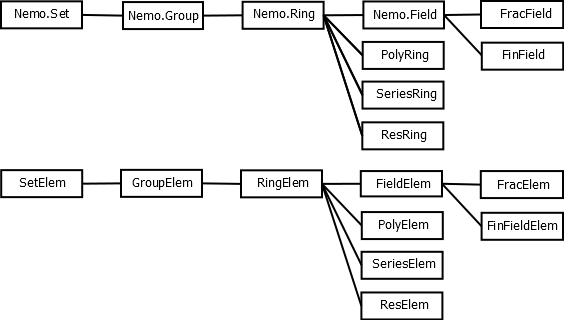

# Appendix A: Types in AbstractAlgebra.jl

On this page we discuss the abstract type hierarchy in AbstractAlgebra.jl and objects
known as parents which contain additional information about groups, rings, fields and
modules, etc., that can't be stored in types alone.

These details are technical and can be skipped or skimmed by new users of 
Julia/AbstractAlgebra.jl. Types are almost never dealt with directly when scripting 
AbstractAlgebra.jl to do mathematical computations. 

In contrast, AbstractAlgebra.jl developers will want to know how we model mathematical
objects and their rings, fields, groups, etc.

## The abstract type hierarchy in AbstractAlgebra.jl

Abstract types in Julia can also belong to one another in a hierarchy. We make use of
such a hierarchy to organise the kinds of mathematical objects in AbstractAlgebra.jl.

For example, the `AbstractAlgebra.Field` abstract type belongs to the 
`AbstractAlgebra.Ring` abstract type. 

In practice, this means that any generic function in AbstractAlgebra.jl which is
designed to work with ring objects will also work with field objects.

In AbstractAlgebra.jl we also distinguish between the elements of a field, say, and
the field itself.

For example, we have an object of type `Generic.PolyRing` to model a generic
polynomial ring, and elements of that polynomial ring would have
type `Generic.Poly`. 

For this purpose, we also have a hierarchy of abstract types, such as `FieldElem`, that
the types of element objects can belong to.



## Why types aren't enough

Naively, one might have expected that rings in AbstractAlgebra.jl could be modeled as
types and their elements as objects with the given type. But there are various reasons
why this is not a good model.

Consider the ring $R = \mathbb{Z}/n\mathbb{Z}$ for a multiprecision integer $n$. If we
were to model the ring $R$ as a type, then the type would somehow need to contain the
modulus $n$. This is not possible in Julia, and in fact it is not desirable, since the
compiler would then recompile all the associated functions every time a different
modulus $n$ was used.

We could attach the modulus $n$ to the objects representing elements of the ring,
rather than their type.

But now we cannot create new elements of the ring $\mathbb{Z}/n\mathbb{Z}$ given only
their type, since the type no longer contains the modulus $n$.

Instead, the way we get around this in AbstractAlgebra.jl is to have special (singleton)
objects that act like types, but are really just ordinary Julia objects. These objects,
called *parent* objects can contain extra information, such as the modulus $n$. 

In order to create new elements of $\mathbb{Z}/n\mathbb{Z}$ as above, we overload the
`call` operator for the parent object.

In the following AbstractAlgebra.jl example, we create the parent object `R`
corresponding to the ring $\mathbb{Z}/7\mathbb{Z}$. We then create a new element `a`
of this ring by calling the parent object `R`.

```julia
R = ResidueRing(ZZ, 7)
a = R(3)
```

Here, `R` is the parent object, containing the modulus $7$. So this example creates 
the element $a = 3 \pmod{7}$.

## More complex example of parent objects

Here is some Julia/AbstractAlgebra.jl code which constructs a polynomial ring over the
integers, a polynomial in that ring and then does some introspection to illustrate the
various relations between the objects and types.

```julia
using AbstractAlgebra

R, x = ZZ["x"]

f = x^2 + 3x + 1

typeof(R) <: PolyRing

typeof(f) <: PolyElem

parent(f) == R
```

## Concrete types in AbstractAlgebra.jl

Here we give a list of the concrete types in AbstractAlgebra.jl.

In parentheses we put the types of the corresponding parent objects.

  - `gfelem{<:Integer}` (`GFField{<:Integer}`)

We also think of various Julia types as though they were AbstractAlgebra.jl types:

  - `BigInt` (`Integers{BigInt}`)
  - `Rational{BigInt}` (`Rationals{BigInt}`)

Then there are various types for generic constructions over a base ring. They are all
parameterised by a type `T` which is the type of the *elements* of the base ring they
are defined over. 

  - `Generic.Poly{T}` (`Generic.PolyRing{T}`)
  - `Generic.MPoly{T}` (`Generic.MPolyRing{T}`)
  - `Generic.RelSeries{T}` (`Generic.RelSeriesRing{T}`)
  - `Generic.AbsSeries{T}` (`Generic.AbsSeriesRing{T}`)
  - `Generic.LaurentSeriesRingElem{T}` (`Generic.LaurentSeriesRing{T}`)
  - `Generic.LaurentSeriesFieldElem{T}` (`Generic.LaurentSeriesField{T}`)
  - `Generic.Res{T}` (`Generic.ResRing{T}`)
  - `Generic.Frac{T}` (`Generic.FracField{T}`)
  - `Generic.Mat{T}` (`Generic.MatSpace{T}`)

